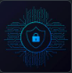

  

<h1 align="center">🛡️ ProofVault.Global 🛡️</h1>

  A collaborative project focused on developing innovative, AI-driven solutions that aimed for detecting life threatening events in real-time.

---

## 🌟 Our Mission

At ProofVault.Global, we are a dedicated team of students from COS40005 Computing Technology Project A, united by the goal of creating impactful technology. Our current project, as outlined in our plan, aims to deliver robust data management, intelligent resource allocation, and multi-device collaboration capabilities to detect life threatening events in real-time.

## 🚀 The Project: ProofVault

Our core focus is on **ProofVault**, a solution designed with key functionalities in mind:

- **Data Management:** Ensuring secure and efficient handling of information.
- **Intelligent Resource Allocation:** Optimizing the distribution of resources for maximum effectiveness.
- **Multi-device Collaboration:** Enabling threat detection across various devices.
- **User Opt-in/Out Features:** Providing users with control over their preferences.
- **(Future Enhancement)** Server-side encryption/decryption for enhanced security.
- **(Future Enhancement)** Smart audio trimming and file compression for optimized data flow.

## 🤝 Our Team

We are a diverse and collaborative team, each contributing unique skills and perspectives to the project:

- **Vinh Le:** Responsible for the overall report.
- **Ba Viet Anh Nguyen:** Focused on Team Code of Conduct, Ethical Considerations, and the Quality Plan.
- **Xuan Tuan Minh Nguyen:** Contributed to the Team Code of Conduct, Solution Approach, Research Investigations, and KOST analysis.
- **Anlee Nguyen:** Focused on the Team Code of Conduct, Stakeholder engagement, and High-level Requirements.
- **Mai An Nguyen:** Contributed to the Team Code of Conduct, Teamwork Roadmap, Problem Statement, Scope definition, and Formatting References.
- **Trong Dat Hoang:** Responsible for the Team Code of Conduct, Risk Mitigation, Product Backlog, Document Formatting, Document Management, Appendix, and incorporating Client feedback.

## 🏛️ Acknowledgment of Country

> We acknowledge the Traditional Owners of the land we lived on while completing this work. We recognise and respect the Aboriginal and Torres Strait Islander peoples as the First Nations of Australia, honouring their enduring connection to Country, culture, and community.
>
> We pay our respects to Elders past, present, and emerging, and acknowledge the continuing sovereignty of all Aboriginal and Torres Strait Islander Nations.

<!-- --- -->

<!-- ## ✨ Connect with Us

[Link to our project repository](https://github.com/ProofVault-Global/ProofVault) -->
